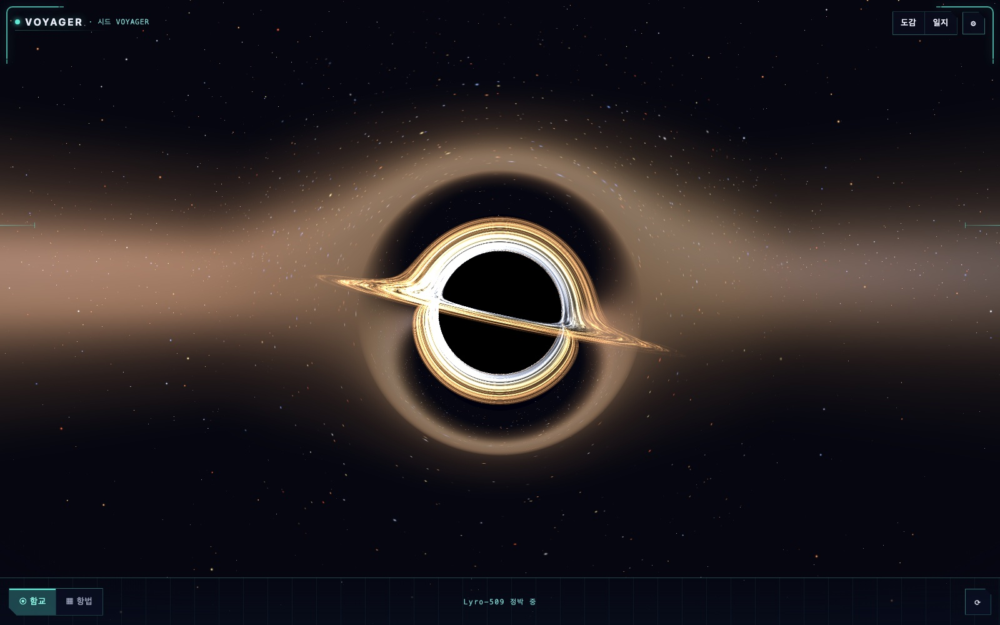
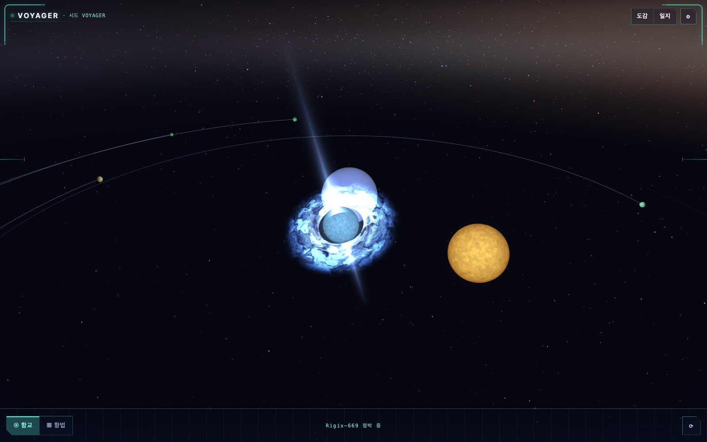
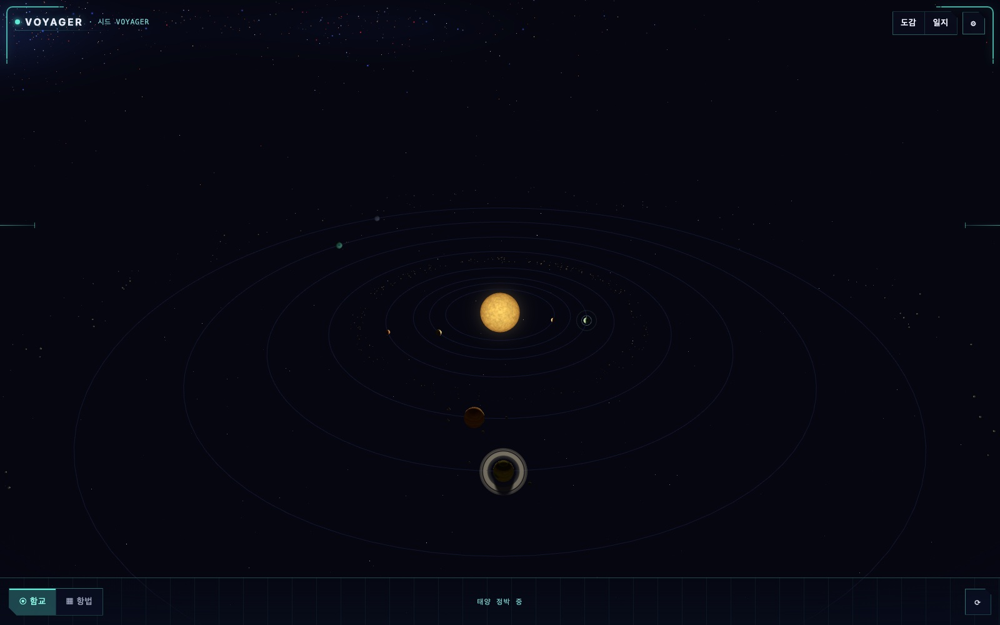
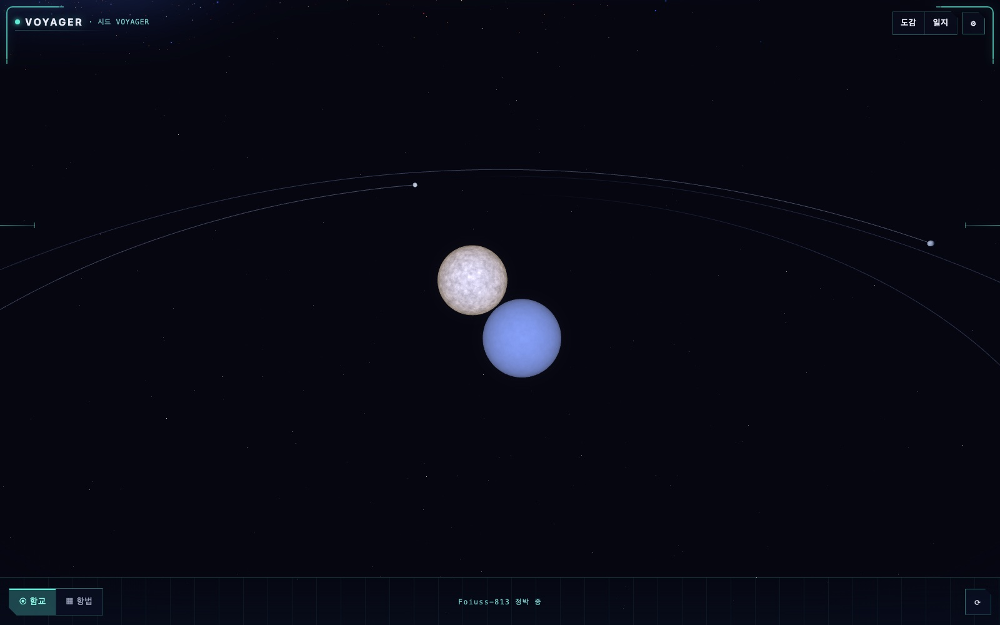

# Voyager

시드 기반으로 무한 생성되는 3D 은하를 항행하는 절차적 우주 시뮬레이션.
**같은 시드는 언제나 같은 우주** — 좌표를 공유하면 친구도 같은 항성계를 만납니다.

## 미리보기

> 아래 천체는 모두 **같은 우주(`VOYAGER` 시드)** 의 서로 다른 항성계입니다. 이미지를 클릭하면
> [실제 빌드](https://voyager-ii.vercel.app/)의 그 좌표로 바로 접속해 직접 둘러볼 수 있어요 —
> 같은 좌표는 누구에게나 같은 모습입니다.

<a href="https://voyager-ii.vercel.app/?seed=VOYAGER&star=0:-1:2:3">
  
</a>

<sub>🕳 <b>Lyro-509</b> · 블랙홀 — 실시간 셰이더로 그린 강착원반·포톤 링. <a href="https://voyager-ii.vercel.app/?seed=VOYAGER&star=0:-1:2:3">▶ 이 항성계 접속</a></sub>

<a href="https://voyager-ii.vercel.app/?seed=VOYAGER&star=-3:1:1:2">
  
</a>

<sub>✦ <b>Rigix-669</b> · 펄서 — 회전하는 중성자성의 상대론적 쌍제트와 청색 자기권 소용돌이(난류 셰이더). <a href="https://voyager-ii.vercel.app/?seed=VOYAGER&star=-3:1:1:2">▶ 이 항성계 접속</a></sub>

<table>
  <tr>
    <td width="50%"><a href="https://voyager-ii.vercel.app/?seed=VOYAGER&star=26:0:10:0"></a></td>
    <td width="50%"><a href="https://voyager-ii.vercel.app/?seed=VOYAGER&star=18:-2:5:0"></a></td>
  </tr>
  <tr>
    <td><sub>☀ <b>태양</b> · 단일성 — G형 황색, 궤도와 고리 행성. <a href="https://voyager-ii.vercel.app/?seed=VOYAGER&star=26:0:10:0">▶ 접속</a></sub></td>
    <td><sub>◐ <b>Foiuss-813</b> · 쌍성계 — A형 + F형 동반성, circumbinary 행성. <a href="https://voyager-ii.vercel.app/?seed=VOYAGER&star=18:-2:5:0">▶ 접속</a></sub></td>
  </tr>
</table>

별 유형은 항법 중 좌표마다 결정론적으로 정해집니다 — 블랙홀 같은 이색 천체는 은하 밀집
구역에서 드물게 나타나고, 다중성계의 행성은 별 무리 전체의 질량중심을 공전합니다(circumbinary).

## 핵심 루프

은하 뷰 → 별 선택 → 워프 → 태양계 뷰 → 행성 탐사 → 항행 일지

## 실행

```bash
npm install
npm run dev          # 개발 서버 (?seed=XXX 로 특정 우주 접속)
npm run build        # 프로덕션 빌드
```

## 품질 게이트

```bash
npm run typecheck    # TS strict + noUncheckedIndexedAccess
npm run lint         # engine/ 순수성 기계 강제 (외부 패키지·초월함수·Math.random 금지)
npm run test         # vitest — 골든 마스터 + fast-check 속성 테스트 포함
npm run test:coverage# 엔진 90% / store·persistence 80% 게이트
npm run test:e2e     # Playwright — 코어 루프 + IndexedDB 차단 폴백
```

## 아트 파이프라인

외계인은 5개 슬롯(appendage/body/pattern/eyes/mouth) SVG 레이어 합성으로 그려진다.

```bash
npm run build:parts  # assets-src/parts/*.svg → svgo → SVGR 타입드 컴포넌트 + 매니페스트
```

실아트 교체 = 같은 파일명의 SVG를 `assets-src/parts/`에 넣고 위 명령 한 번.
파츠는 `var(--alien-primary/secondary/accent)` CSS 변수로 채색된다 (색 변형 에셋 0개).

## 아키텍처

- `src/engine/` — 순수 결정론 생성 코어. React/three/브라우저 API/외부 패키지 임포트가
  ESLint로 차단된다. PRNG(cyrb128+sfc32)는 벤더링·봉인 — 의존성 업데이트가 우주를
  바꾸는 사고를 원천 차단. 골든 마스터 스냅샷이 변경되면 `GEN_VERSION`을 올릴 것.
- `src/store/` — Zustand 단일 스토어. 씬 상태머신(가드 전이) + 영속 기록의 O(1) 캐시.
  진실 원천은 StorageDriver이며 변이 액션이 명시적 write-through를 수행한다.
- `src/persistence/` — StorageDriver 계약. DexieDriver(IndexedDB)와 MemoryDriver(폴백)가
  같은 계약 테스트를 통과한다. 폴백 판정은 기능 감지가 아닌 실제 `db.open()` 프로브.
- `src/scenes/` — R3F. 단일 영속 Canvas, 섹터 가상화(히스테리시스+LRU), 워프 3단
  타임라인(플래시 피크에 씬 스왑 은닉). 게임 규칙 없음 — store 액션 호출만.
- `src/ui/` — DOM 레이어 (z-계약: Canvas 0 / HUD 10 / 오버레이 20 / 시스템 30).
  키보드 접근성은 전부 여기서 — 3D에 텍스트 UI 금지.

상세 설계와 의사결정 기록: [docs/features/stellar-voyage/](docs/features/stellar-voyage/)
